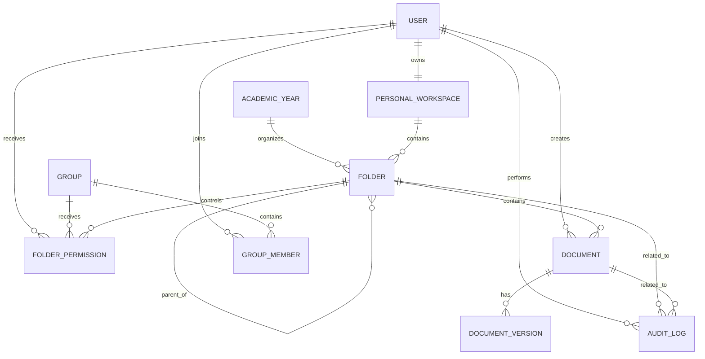

# Mô hình dữ liệu

## 1. ERD mức khái niệm

## 2. Bảng `users`

| Cột | Kiểu | Ghi chú |
|---|---|---|
| id | uuid | PK |
| email | varchar unique | Gmail đăng nhập |
| full_name | varchar | Họ tên |
| avatar_url | text nullable | Ảnh Google |
| global_role | enum | `ADMIN`, `USER` |
| status | enum | `PENDING`, `ACTIVE`, `SUSPENDED`, `INACTIVE` |
| last_login_at | timestamp nullable | Lần đăng nhập gần nhất |
| created_at | timestamp | |
| updated_at | timestamp | |

## 3. Bảng `personal_workspaces`

| Cột | Kiểu | Ghi chú |
|---|---|---|
| id | uuid | PK |
| owner_user_id | uuid unique | FK users |
| root_folder_id | uuid unique | FK folders |
| created_at | timestamp | |

Kho cá nhân được biểu diễn bằng một root folder đặc biệt, không hiển thị trong cây thư mục dùng chung.

## 4. Bảng `academic_years`

| Cột | Kiểu | Ghi chú |
|---|---|---|
| id | uuid | PK |
| name | varchar unique | Ví dụ `2026-2027` |
| starts_on | date nullable | |
| ends_on | date nullable | |
| is_active | boolean | |
| created_at | timestamp | |

## 5. Bảng `folders`

| Cột | Kiểu | Ghi chú |
|---|---|---|
| id | uuid | PK |
| name | varchar | Tên thư mục |
| parent_id | uuid nullable | Self FK |
| workspace_type | enum | `PERSONAL`, `SHARED` |
| owner_user_id | uuid nullable | Chỉ dùng cho personal root hoặc thư mục cần ownership |
| academic_year_id | uuid nullable | Dùng cho shared tree theo năm học |
| inherit_permissions | boolean | Mặc định true |
| is_locked | boolean | Mặc định false |
| lock_descendants | boolean | Mặc định false |
| sort_order | integer | |
| created_by | uuid | |
| deleted_at | timestamp nullable | Soft delete |
| deleted_by | uuid nullable | |
| created_at | timestamp | |
| updated_at | timestamp | |

Ràng buộc:

- Không cho parent là chính nó.
- Không cho di chuyển vào hậu duệ của chính thư mục.
- Personal folder chỉ thuộc đúng một owner workspace.
- Shared folder không có owner cá nhân bắt buộc.

## 6. Bảng `documents`

| Cột | Kiểu | Ghi chú |
|---|---|---|
| id | uuid | PK |
| folder_id | uuid | FK folders |
| owner_user_id | uuid | Người tạo/chủ sở hữu |
| title | varchar | Tên hiển thị |
| description | text nullable | |
| document_kind | enum | `FILE`, `GOOGLE_DRIVE_LINK`, `YOUTUBE_LINK` |
| mime_type | varchar nullable | FILE |
| file_extension | varchar nullable | FILE |
| size_bytes | bigint nullable | FILE |
| storage_key | text nullable | FILE |
| external_url | text nullable | Link |
| current_version_id | uuid nullable | FK document_versions |
| status | enum | `ACTIVE`, `ARCHIVED` |
| deleted_at | timestamp nullable | Soft delete |
| deleted_by | uuid nullable | |
| created_at | timestamp | |
| updated_at | timestamp | |

## 7. Bảng `document_versions`

| Cột | Kiểu | Ghi chú |
|---|---|---|
| id | uuid | PK |
| document_id | uuid | FK documents |
| version_number | integer | Tăng dần |
| storage_key | text nullable | FILE |
| external_url | text nullable | Link |
| mime_type | varchar nullable | |
| size_bytes | bigint nullable | |
| change_note | text nullable | |
| created_by | uuid | |
| created_at | timestamp | |

MVP có thể triển khai versioning ngay hoặc để schema sẵn và chỉ tạo version 1. Khuyến nghị triển khai ít nhất phiên bản file để tránh ghi đè mất dữ liệu.

## 8. Bảng `groups`

| Cột | Kiểu | Ghi chú |
|---|---|---|
| id | uuid | PK |
| name | varchar | Tên nhóm |
| description | text nullable | |
| created_by | uuid | |
| created_at | timestamp | |
| updated_at | timestamp | |

## 9. Bảng `group_members`

| Cột | Kiểu | Ghi chú |
|---|---|---|
| group_id | uuid | Composite PK |
| user_id | uuid | Composite PK |
| created_at | timestamp | |

## 10. Bảng `folder_permissions`

| Cột | Kiểu | Ghi chú |
|---|---|---|
| id | uuid | PK |
| folder_id | uuid | FK folders |
| principal_type | enum | `USER`, `GROUP` |
| user_id | uuid nullable | |
| group_id | uuid nullable | |
| permissions | jsonb hoặc bigint bitmask | Danh sách permission |
| applies_to_descendants | boolean | |
| granted_by | uuid | |
| created_at | timestamp | |
| updated_at | timestamp | |

Ràng buộc:

- Chỉ một trong `user_id`, `group_id` được có giá trị.
- Unique theo folder + principal.

Khuyến nghị MVP dùng `jsonb string[]` để dễ đọc và debug. Khi cần tối ưu mới chuyển bitmask.

## 11. Bảng `audit_logs`

| Cột | Kiểu | Ghi chú |
|---|---|---|
| id | uuid | PK |
| actor_user_id | uuid nullable | Có thể null cho system job |
| action | varchar | Ví dụ `DOCUMENT_UPLOADED` |
| entity_type | varchar | `USER`, `FOLDER`, `DOCUMENT`, `PERMISSION` |
| entity_id | uuid nullable | |
| folder_id | uuid nullable | Hỗ trợ lọc theo phạm vi |
| metadata | jsonb | before, after, filename, target user... |
| ip_address | inet nullable | |
| user_agent | text nullable | |
| created_at | timestamp | |

Audit log là append-only. Không cho sửa/xóa qua API thông thường.

## 12. Bảng `system_settings`

| Cột | Kiểu | Ghi chú |
|---|---|---|
| key | varchar PK | |
| value | jsonb | |
| updated_by | uuid | |
| updated_at | timestamp | |

Ví dụ:

- `max_file_size_mb`
- `allowed_extensions`
- `trash_retention_days`
- `max_folder_depth`

## 13. Index quan trọng

- `users(email)` unique.
- `folders(parent_id, deleted_at)`.
- `folders(academic_year_id, workspace_type)`.
- `documents(folder_id, deleted_at)`.
- `documents(owner_user_id, deleted_at)`.
- Full-text hoặc trigram index cho `documents.title`.
- `folder_permissions(folder_id, principal_type, user_id, group_id)`.
- `audit_logs(folder_id, created_at desc)`.
- `audit_logs(actor_user_id, created_at desc)`.
